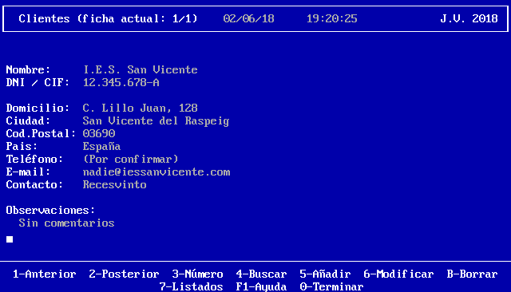

# Garage POS

## Version 01: Add to array of structs, save and load

This first version must contain an array that will allow the user to store up to 
1000 structs related to clients (name, cif, address, city, zip code, country, 
telephone number, e-mail, contact person, comments). The main screen should 
look similar to this one:

In this first version only the following options will work: 5 (Add), 1 (go to 
the previous record, if it exists) and 2 (go to the next record, if it exists), 
as well as 0 (Quit).

When leaving the program, data must be saved to file. When entering the 
program, the previous data should be loaded, if they exist.

The interface can be in Spanish or English, but the source (names of variables, 
comments, etc) must be in English.

The class structure is not important yet, because that will be formalized in a 
later version.

---

## Entrega 01: Añadir a array de structs, guardar y cargar

Esta primera entrega debe contener un array que permita almacenar hasta 1000 
structs relacionados con clientes (nombre, cif, domicilio, ciudad, código 
postal, país, teléfono, e-mail, persona de contacto, observaciones). La 
pantalla principal debe tener una apariencia parecida a ésta:

En esta primera entrega sólo funcionarán las opciones 5 (Añadir), 1
(ir a la ficha anterior, si existe) y 2 (ir a la ficha posterior, si existe),
así como la 0 (Terminar).

Al salir del programa se deben guardar en fichero los datos. Al entrar al
programa se deben cargar los datos anteriores, si es que existen.

El interfaz puede estar en castellano o en inglés, pero el fuente (nombres
de variables, comentarios, etc) debe estar en inglés.

Todavía no es importante la estructura de clases, porque eso se formalizará
en una entrega posterior.

