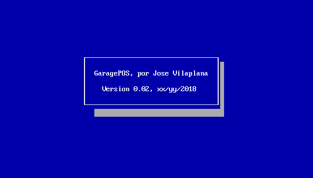
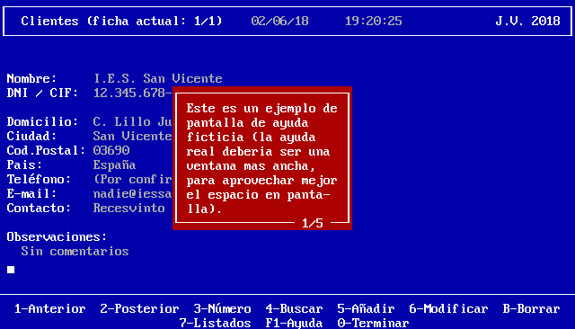

# Garage POS

## Version 05: Minor improvements

At the beginning of the session, a welcome screen similar to the
example shown, which will be kept visible for 5 seconds (or less, if
any key is pressed).

The "client management" clock will show hours, minutes and seconds, and
will be updated every second, even if no key is pressed.

In the Customers screen, Help will be operative, and it will show a 
window made up by several pages of information, as shown in the 
following image. The user can press ESC to stop reading the help, or 
another key to move to the next page.

You must use the features of the "EnhancedConsole" class in the customer 
management section, wherever it fits.

It is important to have quality code in the customer management 
section, because it will be reused in the next version of the project 
to implement the product management section.

## Entrega 05: Ligeras mejoras

Al comenzar la sesión, debe aparecer una pantalla de bienvenida 
parecida al ejemplo que se muestra, que se mantendrá durante 5 segundos 
(o menos, si se pulsa alguna tecla).

El reloj de la "gestión de clientes" mostrará hora, minutos y segundos, 
y se actualizará cada segundo, aunque no se pulse una tecla.

En la pantalla de Clientes, estará operativa la Ayuda, que mostrará una 
ventana formada por varias páginas de información, conforme a la 
siguiente imagen. Se podrá pulsar ESC para dejar de leer la ayuda, o 
bien otra tecla para pasar a la siguiente página.

Se debe usar las posibilidades de la clase "EnhancedConsole" en todas 
las partes de la gestión de clientes en las que resulte conveniente.

Es importante que el código final de la gestión de clientes sea de una 
cierta calidad, porque se aprovechará en la siguiente versión del 
proyecto para implementar la gestión de productos.
