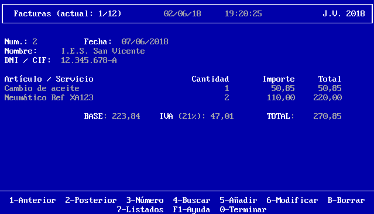

# Garage POS

## Version 08 : Invoices and lines, second approach.

The class InvoiceManager class must be almost totally operational (except 
modification): the user must be able to create an invoice, indicating the 
customer code and the code of each product. It should also be possible to 
browse invoices (previous, posterior, number) and search them (for date, 
customer name and names of the products it contains).

The appearance that should be quite like this one (except perhaps for the 
colors, because writing in colors will make it difficult to scroll in the next 
version):

The information of each invoice will be saved in a file whose name will be 
similar to "invoice-2018-2.dat" (for invoice 2 of the year 2018). You can 
choose to load all the invoices in memory from the corresponding files when 
launching the program (recommended), or to open open the file or files you need 
for each operation (move forward, backward, go to number, search) in real time. 

In any case, the source must be modular, with functions of small size and must 
not have repetitive code.

---

## Entrega 08: Facturas y líneas, segunda aproximación

La clase InvoiceManager (GestionDeFacturas) debe estar casi totalmente 
operativa (excepto la modificación): se deberá poder crear una factura, 
indicando el código del cliente y el código de cada producto. También se deberá 
poder visualizar facturas (anterior, posterior, número) y buscar en ellas (por 
fecha, nombre de cliente y nombres de los productos que contiene).

La apariencia a la que se debe ir acercando es la siguiente (salvo quizá por 
los colores, porque el escribir en colores complicará hacer scroll en la 
siguiente versión):

La información de cada factura se guardará en un fichero cuyo nombre será 
similar a "invoice-2018-2.dat" (para la factura 2 del ejercicio fiscal de 
2018). Se puede optar por cargar todas las facturas en memoria desde los 
correspondientes ficheros al lanzar el programa (recomendado) o bien por que 
cada operación (avanzar, retroceder, números, buscar) abra el fichero o 
ficheros que necesite en el momento. 

En cualquier caso, el fuente deberá ser modular, con funciones de pequeño 
tamaño y sin código repetitivo.
